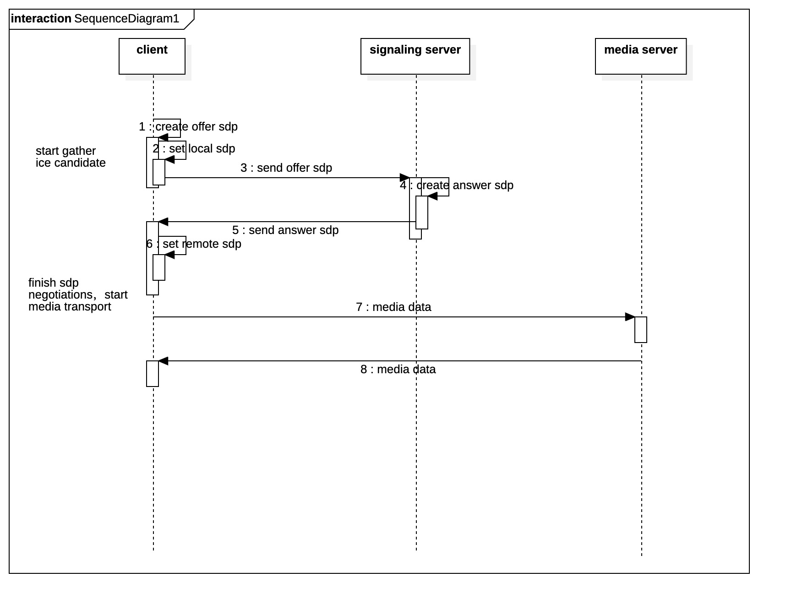

# webrtc中的媒体数据交互流程

由于webrtc提供了更加灵活的api组合，并未限定如何进行信令传输方式，信令传输通道可采用跨平台统一的例如websockt库及基于ws的socket.io库等，由于信令传输库不在本文介绍范围内，故不多做讨论，理论上基于tcp的安全传输且有现成的跨端成熟的通信库是较好的选择。

本文主要介绍webrtc中 sdp（session description protocol）[会话描述协议](https://tools.ietf.org/html/rfc2327)的交互流程

话不多说 先上图

这里假设媒体通信架构采用mcu或者sfu的模式（对于mesh架构的模式 由于去中心化处理 不存在媒体服务器 但sdp的信令交互还是需要信令服务器来实现且mesh流程上稍有不同 总体来讲就是要把本端视为local 其它端视为remote 而不是信令服务器）

1. client创建offer的sdp
2. client安装本地sdp 此时开始收集ice candidate，收集完成会通过信令通道发送至信令服务器，信令服务器再转交媒体服务器或者其它终端 目的是nat穿透，关于nat穿透的问题 之后再讲
3. 通过信令通道发送offer到信令服务器
4. 信令服务器创建answer的sdp
5. 信令服务器回复answer到client
6. client接收到answer sdp并进行安装 至此sdp的简易交互流程完成 即将开始媒体数据传输
7. 媒体数据通道建立 媒体数据传输

总体来说 一个webrtc连接的建立 需要local sdp ，remote sdp 并按顺序进行安装设置以后完成协商内容 即可进行媒体通信

