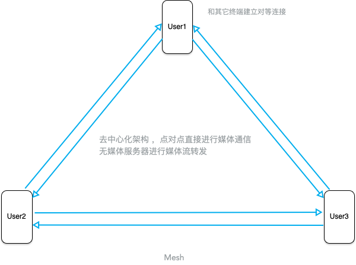

# 多人音视频方案的常用架构

在媒体信令协商完成后，媒体通道建立主要有以下三种架构模式

## Mesh

去中心化的设计使得无媒体服务器转发及一些编解码混流处理，媒体连接建立简单直接，缺点是多连接的媒体通道建立导致终端编解码cpu、带宽占用高。

## MCU (MultiPoint Control Unit)

中心化设计混码使得终端仅需一路mix混码流即可获取所有媒体数据，降低终端带宽及cpu占用，缺点是媒体服务器需要解码混流再编码及一些容屏处理画面布局等操作导致服务器cpu占用过高，且终端接收到的混码流无法分割，灵活度不高

## SFU(Selective Forwarding Unit)

相比于mcu 媒体服务器不提供解码混码等操作，基本仅提供媒体数据转发到各终端，优点是各终端可以获取到粒度更细的单路流而不是混流，灵活度更高，且媒体服务器配置要求也不需要太高，缺点是由于建立多路连接导致的带宽占用上升。

这里仅仅只讨论了媒体通道建立以后的通信架构，而对于媒体通信的建立请看[这里](https://github.com/AshineReal/Inspiration/webrtc_relative)

实际情况下由于云平台的迅速发展，更多的是mcu和sfu架构的选择，甚至是mcu和sfu的混合架构比如open webrtc toolkit同时满足混流及单路流传输。

