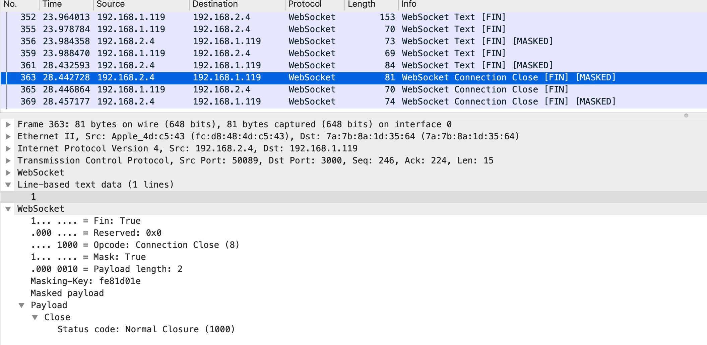
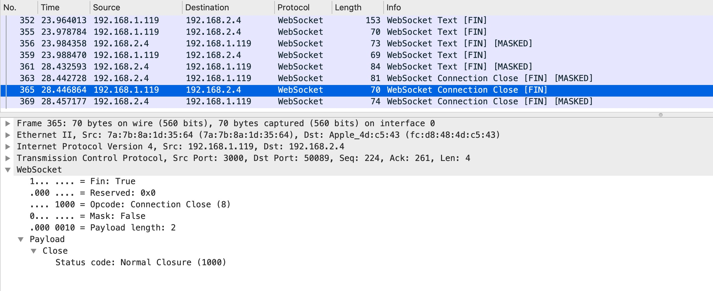

# 记录一处发现的socketio cpp版本的错误

##### 先描述一下结论

socket.io cpp版本的库调用close以后会等待3秒才会回调socket_close_listener的监听回调(而其它版本的实现是调用close立马监听回调，这样导致使用cpp版本的客户端不能及时回调而导致一些后续的业务流程处理异常)


##### 问题原因

由于在使用[open webrtc toolkit](https://github.com/open-webrtc-toolkit)的时候，调用离开房间的方法onSuccess回调总是在调用该方法3秒后回调，导致owt的一些资源清理及状态复位未及时清理及恢复，使后续在该3秒回调之前的一些操作失效。


##### 问题查找

找到调用处leaveWithOnSuccess处，是_nativeConferenceClient调用了Leave方法

```ObjC
- (void)leaveWithOnSuccess:(void (^)())onSuccess
                 onFailure:(void (^)(NSError*))onFailure {
  _nativeConferenceClient->Leave(
      [=]() {
        if (onSuccess != nil)
          onSuccess();
      },
      [=](std::unique_ptr<owt::base::Exception> e) {
        [self triggerOnFailure:onFailure withException:(std::move(e))];
      });
}
```

找到confereclient leave的调用部分，是signaling_channel_调用Disconnect方法

```cpp
void ConferenceClient::Leave(
    std::function<void()> on_success,
    std::function<void(std::unique_ptr<Exception>)> on_failure) {
  if (!CheckSignalingChannelOnline(on_failure)) {
    return;
  }
  {
    std::lock_guard<std::mutex> lock(publish_pcs_mutex_);
    publish_id_label_map_.clear();
    publish_pcs_.clear();
  }
  {
    std::lock_guard<std::mutex> lock(subscribe_pcs_mutex_);
    subscribe_pcs_.clear();
  }
  signaling_channel_->Disconnect(RunInEventQueue(on_success), on_failure);
}
```

继续到conferencesocketsignalingchannel disconnect部分

```cpp
void ConferenceSocketSignalingChannel::Disconnect(
    std::function<void()> on_success,
    std::function<void(std::unique_ptr<Exception>)> on_failure) {
  if (!socket_client_->opened() && reconnection_attempted_ == 0 && on_failure) {
    // Socket.IO is not connected and not reconnecting.
    std::unique_ptr<Exception> e(new Exception(
        ExceptionType::kConferenceInvalidSession, "Socket.IO is not connected."));
    on_failure(std::move(e));
    // TODO: A corner case is execute Disconnect before first reconnection
    // attempt. So we don't return, still try to close socket.
  }
  reconnection_attempted_ = kReconnectionAttempts;
  disconnect_complete_ = on_success;
  if (socket_client_->opened()) {
    // Clear all pending failure callbacks after successful disconnect, don't check resp.
    socket_client_->socket()->emit(kEventNameLogout, nullptr,
                                   [=](sio::message::list const& msg) {
                                     DropQueuedMessages();
                                     socket_client_->close();
                                   });
  }
}
```

这个方法内部需要注意两点:
1. **disconnect_complete_ = on_success** 这里将之前一步步传入的success的回调保存到disconnect_complete_这个成员变量中方便后续的触发调用。

2. 然后最终是socket_client_调用的发送logout消息告诉服务器登出，然后在发送成功的回调处调用的 **socket_client_->close()** 这一步说明了最终调用是socketio的client调用的close方法

但是需要留意disconnect_complete_是什么时候触发的呢，继续在当前文件里面寻找找到如下调用触发的地方

```cpp
void ConferenceSocketSignalingChannel::TriggerOnServerDisconnected() {
  if (disconnect_complete_) {
    disconnect_complete_();
  }
  disconnect_complete_ = nullptr;
  for (auto it = observers_.begin(); it != observers_.end(); ++it) {
    (*it)->OnServerDisconnected();
  }
}
```

根据命名猜想是服务器disconnected的时候会触发该方法，继续寻找该方法触发的地方
发现原来是设置在了socekt_client的socket_close_listener监听器回调里面触发的

```cpp
socket_client_->set_socket_close_listener(
      [weak_this](std::string const& nsp) {
        RTC_LOG(LS_INFO) << "Socket.IO disconnected.";
        auto that = weak_this.lock();
        if (that && (that->reconnection_attempted_ >= kReconnectionAttempts ||
                     that->disconnect_complete_)) {
          that->TriggerOnServerDisconnected();
        }
      });
```

那么到这里可以理清楚这个leave的整体流程，从业务接口到下层实现层层传递，到最终是通过调用socket_client的close方法，然后通过它的socket_close_listener的监听器回调触发了on_success()回调，再往下就是socketio的cpp库的部分了

也就是说owt的leaveroom回调有3秒延时，最终是因为socketio cpp库的原因导致的。

## 验证

前面说了owt的源码分析与猜想,分析结果直指socketio库的close监听的回调延时了3秒，下面通过源码分析及抓包分析来验证这个猜想

##### 刨根
先分析socketio cpp版本的源码

先看调用close()

```cpp
  // Closes the connection
    void client::close()
    {
        m_impl->close();
    }
```

继续往下找到sio_client_impl.cpp的close实现部分

```cpp
    void client_impl::close()
    {
        m_con_state = con_closing;
        this->sockets_invoke_void(&sio::socket::close);
        m_client.get_io_service().dispatch(lib::bind(&client_impl::close_impl, this,close::status::normal,"End by user"));
    }
```

这里主要就是invoke了 **sio::socket::close** 
然后找到 sio_socket.cpp内部实现

```cpp
    void socket::close()
    {
        m_impl->close();
    }
```

继续找到socket::impl close部分

```cpp
    void socket::impl::close()
    {
        NULL_GUARD(m_client);
        if(m_connected)
        {
            packet p(packet::type_disconnect,m_nsp);
            send_packet(p);
            
            if(!m_connection_timer)
            {
                m_connection_timer.reset(new boost::asio::deadline_timer(m_client->get_io_service()));
            }
            boost::system::error_code ec;
            m_connection_timer->expires_from_now(boost::posix_time::milliseconds(3000), ec);
            m_connection_timer->async_wait(lib::bind(&socket::impl::on_close, this));
        }
    }
```

解读这个方法中的主要操作:
1. **packet p(packet::type_disconnect,m_nsp)** 生成一个type为disconnect的packet包
2. **send_packet(p)** 发送这个packet包
3. 重置了m_connection_timer超时时间
4. **m_connection_timer->expires_from_now(boost::posix_time::milliseconds(3000), ec)** 这个方法定义过期时间为从当前计算机时间开始的3000毫秒以后
5. **m_connection_timer->async_wait(lib::bind(&socket::impl::on_close, this))** 这里直接async_wait然后到了expire以后会触发 **socket::impl::on_close** 方法

到这里应该就了解了为什么会稳定到3秒这个延迟,然后就是在m_connection_timer expire之前会发送一个disconnect的packet出去，这个packet作用是什么呢（这里留个flag，之后会解释），另外还有一个信息就是3秒后触发的on_close,会不会就是最终导致close_socket_listener监听的回调呢，继续往下分析

我们先看on_close的实现部分

```cpp
void socket::impl::on_close()
    {
        NULL_GUARD(m_client);
        sio::client_impl *client = m_client;
        m_client = NULL;

        if(m_connection_timer)
        {
            m_connection_timer->cancel();
            m_connection_timer.reset();
        }
        m_connected = false;
		{
			std::lock_guard<std::mutex> guard(m_packet_mutex);
			while (!m_packet_queue.empty()) {
				m_packet_queue.pop();
			}
		}
        client->on_socket_closed(m_nsp);
        client->remove_socket(m_nsp);
    }
```

主要方法调用在 **client->on_socket_closed(m_nsp)** 继续往上寻找实现

```cpp
    void client_impl::on_socket_closed(string const& nsp)
    {
        if(m_socket_close_listener)m_socket_close_listener(nsp);
    }
```

果然，到这里就验证了猜想 **在m_connection_timer3秒expire以后会最终触发socket_close_listener的监听回调**

那么如果不等到m_connection_timer的expire触发的话,需要怎么触发on_close呢，
继续找on_close的触发地方

经过排查找到如下触发部分（源代码过长 这里只截取了部分关键代码）

```cpp
   void socket::impl::on_message_packet(packet const& p)
    {
        ...
        ..
        .
        case packet::type_disconnect:
        {
            LOG("Received Message type (Disconnect)"<<std::endl);
            this->on_close();
            break;
        }
    }
```
解释下就是收到message_packet的时候解析到是disconnect类型的packet就会触发on_close()

找到on_message_packet触发部分

```cpp
void client_impl::on_decode(packet const& p)
    {
        switch(p.get_frame())
        {
        case packet::frame_message:
        {
            socket::ptr so_ptr = get_socket_locked(p.get_nsp());
            if(so_ptr)so_ptr->on_message_packet(p);
            break;
        }
        case packet::frame_open:
            this->on_handshake(p.get_message());
            break;
        case packet::frame_close:
            //FIXME how to deal?
            this->close_impl(close::status::abnormal_close, "End by server");
            break;
        case packet::frame_pong:
            this->on_pong();
            break;

        default:
            break;
        }
    }
```
也就是说socket的on_decode的解析方法回调判断是frame_message是帧消息类型的数据，且这个帧消息类型为disconnect就会触发on_close()

所以 **m_connection_timer3秒expire以后触发socket_close_listener的监听回调** 是
因为没有收到disconnect的消息帧导致的PLAN B兜底策略!!!

为了验证这个问题，我又去下载了socketio swift版本并翻看了实现（这里只截出关键代码）


```swift
    private func _disconnect(reason: String) {
        guard connected && !closed else { return closeOutEngine(reason: reason) }

        DefaultSocketLogger.Logger.log("Engine is being closed.", type: SocketEngine.logType)

        if polling {
            disconnectPolling(reason: reason)
        } else {
            sendWebSocketMessage("", withType: .close, withData: [], completion: nil)
            closeOutEngine(reason: reason)
        }
    }
```

在SocketEngine.swift中调用_disconnect然后发送了一个close消息(这一步和cpp版本实现是一致的，都发送了close的消息,还可以看到该消息是1)，但是这却继续调用了closeOutEngine找到该方法

```swift
 private func closeOutEngine(reason: String) {
        sid = ""
        closed = true
        invalidated = true
        connected = false

        ws?.disconnect()
        stopPolling()
        client?.engineDidClose(reason: reason)
    }
```

**通过代理回调了engineDidClose方法，也就是说swift版本的socketio在发送了消息以后立即主动触发了一个关闭的代理回调方法告知上层业务。(而cpp版本的实现中却没有通过主动调用的方式去触发监听回调，我又查看了java的实现，确实是发送了close以后本地又触发监听的回调，这里就不贴出java的实现了)**

另外这个close消息是文本消息 它就是“1”

```swift
@objc public enum SocketEnginePacketType : Int {
    /// Open message.
    case open

    /// Close message.
    case close

    /// Ping message.
    case ping

    /// Pong message.
    case pong

    /// Regular message.
    case message

    /// Upgrade message.
    case upgrade

    /// NOOP.
    case noop
}
```

和我在该实现中的其它disconnect方法发送的消息文本是一致的，例如这里

```swift
    open func disconnectSocket(_ socket: SocketIOClient) {
        engine?.send("1\(socket.nsp),", withData: [])

        socket.didDisconnect(reason: "Namespace leave")
    }
```

##### 问底

那么这两种实现到底哪张才是正确的呢，是服务器没回close消息导致cpp版本的socketio没有及时回调到close_socket_listener的监听还是服务根本不需要回close的frame message，自己主动触发回调呢。

为了验证这个问题，我本地搭建了一个node.js的服务器，使用socketio官方库模拟实现一个简易的建立及断开连接的过程，然后通过抓包来分析该过程

由于socketio是基于websocket的[rfc6455](https://tools.ietf.org/html/rfc6455#section-5.5.1)标准实现的库，又在其之上添加扩展成偏向应用的简易接口调用的实现，它并不是一种协议

192.168.2.4 -> client 
192.168.1.119 -> server



websocket协议层部分看到opcode是1 ,代表文本消息
然后line-based text data是 1 （socketio的实现里面可以了解这个1是close的文本消息） 然后看到opcode是8 在rfc6455标准中代表connection close
就是说在client端的关闭中给服务器发送了文本1及标识connection close的ws包

然后继续查看服务器的回发


可以看到仅仅只有opcode为8 代表的connection close，并没有close的文本mesaage！！

所以对于socketio的标准服务器实现来说，其根本没有发送这个close的消息，再根据其它语言的实现版本来看，也不需要等待服务器回发close的消息，正常做法是在client调用close以后，主动触发监听回调，而不是等待服务器close的message或者expire超时再触发这个回调，这个问题就在于cpp版本实现的socketio库采用了expire延时3秒触发的方式并不是那么完美，这样处理的结果就会导致库的使用方（在这里是[owt](https://github.com/open-webrtc-toolkit)）会因为其不及时性导致一些异常情况诞生且不可控。
而至于为什么socketio cpp版本的库的开发者没有及时发现并修改这个问题，我猜想可能是因为业务场景并没有涉及到需要频繁断开、建立socketio的连接有关，在owt中，这一场景的模拟过程为 user join room 以及user leave room的过程，并可能在频繁的断开和建立连接过程中因为该库的实现有误而导致问题。owt却也因为使用了有问题依赖库导致自身的处理异常并未发现（我甚至给owt官方提交了iusses，但官方似乎并未意识到该问题的严重性，也是owt自测不足，依赖三方库却因三方库的缺陷导致自身问题视而不见）

##### 后续

我并没有修改该错误并提交pull request到socketio的官方库 是因为我翻看了该库的issues lists，了解到其实该库有很多问题并没有解决，而且看issues提交记录，似乎已经很久没有进行维护，官方已经逐渐停止维护；其次能力有限，c++实在复杂，研究并不深入，就不贻笑大方了。


